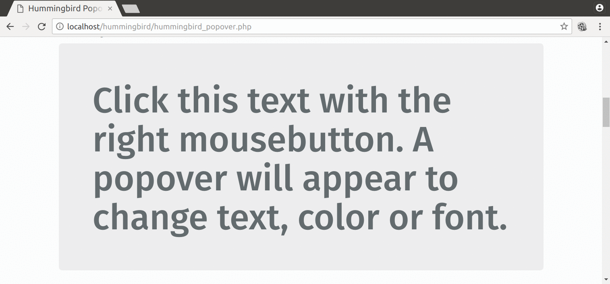

# hummingbird-popover

A tiny and fast jQuery plugin for multi-layer popovers

#### [Visit demo page ](https://hummingbird-dev.000webhostapp.com/hummingbird-popover)

## Features

- Opens popover menues on right mouse click.
- Based on simple HTML lists.
- Can be attached to any HTML element.
- Supports multiple layer menues.
- Supports multiple popovers on one page.


## Dependencies

- bootstrap v3.3.7
- jQuery v3.1.1 
- font-awesome v4.7.0 

The hummingbird-popover is tested with these versions, newer versions work most probably as well.

## Example 




## Getting started
### Usage

Add the following resources for the hummingbird-popover to function correctly:

```html
	
    <!-- Required Stylesheets -->
    <link href="/path/to/bootstrap.css" rel="stylesheet">
    <link href="/path/to/font-awesome.css" rel="stylesheet">
    <link href="/path/to/hummingbird-popover.css" rel="stylesheet">

    <!-- Required Javascript -->
    <script src="/path/to/jquery.js"></script>
    <script src="/path/to/bootstrap.js"></script>
    <script src="/path/to/hummingbird-popover.js"></script>

```

Create an HTML element as bindpoint for the popover, e.g. an
`<h1>`. The *id* and *data-id* can be chosen
arbitrarily. However, it is important that the *data-id* of the bindpoint and the
*id* of the popover "structure", i.e. the list containing the
popover content, are **equal**.

``` html

<h1 id="theText" data-id="changeText">Click this text with the right mousebutton. 
A popover will appear to change text, color or font.</h1>

```

Create a simple structure for the popover content. The class must be
*hummingbird-popover-converter* and the *id* must be
**equal** to the *data-id* of the bindpoint (see above). The
hyphens indicate the level and the belonging of the popover
items. This means that items of one popover can have a popover by
themselves. In the example the base popover contains *Change
text*, *Change color* and *Change font*.  The *Change
color* has again a popover containing *Red colors* and *Blue
colors*, etc.

``` html

<div class="hummingbird-popover-converter" id="changeText">
<li>Change text</li>
<li>Change color</li>
<li>-Red colors</li>
<li>--DarkRed</li>
<li>--Red</li>
<li>--OrangeRed</li>
<li>-Blue colors</li>
<li>--MidnightBlue</li>
<li>--Blue</li>
<li>--LightSkyBlue</li>
<li>Change font</li>
<li>-bold</li>
<li>-normal</li>
<li>-lighter</li>
</div>

```

Initialize hummingbird-popover and bind it to the HTML element (`#theText`).

``` javascript

$("#theText").hummingbirdPopover();

```

Congratulations, you are done, your HTML element has now right mouseclick popover functionality.


### Multiple popovers on one page

Multiple popovers on one page can be implemented straight forward. Just create a new bindpoint
and new popover content. Make sure to use the same names for the bindpoint's *data-id* and the
content's *id*. Then initialize the hummingbird-popover on the new bindpoint.


### Events

An event is fired if a popover option has been selected (left mouse click) so that your application can respond:

- **hummingbirdPopover_action**<br>
The event can be catched as shown below. The selected popover option can be retrieved from the *data* parameter.


``` javascript

$("#theText").on("hummingbirdPopover_action", function(e,data) {
   //do something ...

      if (data.includes("Red") || data.includes("Blue")) {
         $("#theText").css({"color":data});
      }
      if (data == "bold" || data == "normal" || data == "lighter") {
         $("#theText").css({"font-weight":data});
      }

});

```


